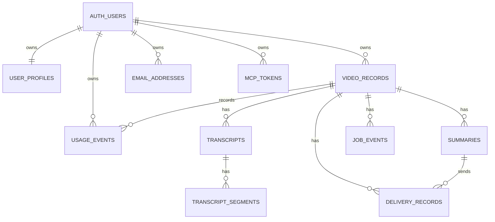

# Video Digest Database Schema

## 目标

本文档记录 Video Digest 后端的数据库表结构设计。MVP 数据库采用 Supabase Postgres，登录用户复用 Supabase Auth 的 `auth.users`，业务表通过 `user_id` 绑定用户归属。

该设计服务于第一版后端架构：

- 网站页面直接读取记录、摘要、字幕、投递和用量数据。
- `/api/mcp` 统一创建任务、读取任务结果、触发邮件投递。
- Worker 消费队列后写回任务状态、字幕、摘要和投递结果。
- 外部 agent 通过 MCP token 访问同一套用户数据边界。

## 数据库选择

MVP 使用：

```txt
Supabase Postgres
  -> SQL migrations
  -> Supabase Auth
  -> Row Level Security
```

暂不引入 Prisma 或 Drizzle。第一阶段直接使用 SQL migration，便于定义 RLS、policy、trigger、索引和 Supabase Auth 关联。

## 设计原则

1. `video_records` 是任务和页面展示的主事实表。
2. 所有用户业务数据必须带 `user_id`。
3. 长任务状态写入 Postgres，Redis/BullMQ 只负责任务派发。
4. 邮件投递必须绑定已验证邮箱，不能让 agent 任意传入目标邮箱。
5. MCP token 只保存 hash 和展示用 prefix，不保存明文。
6. 字幕和摘要结果允许后续扩展为多版本。
7. 用量统计通过事件流水生成，避免只存一份容易漂移的聚合值。

## 表结构

### user_profiles

补充 Supabase Auth 用户资料和套餐信息。

```sql
create table public.user_profiles (
  id uuid primary key references auth.users(id) on delete cascade,
  email text,
  plan text not null default 'free',
  created_at timestamptz not null default now(),
  updated_at timestamptz not null default now()
);
```

字段说明：

| 字段 | 说明 |
| --- | --- |
| `id` | 与 `auth.users.id` 一致 |
| `email` | 展示用邮箱，真实登录仍以 Supabase Auth 为准 |
| `plan` | `free`、`pro`、`admin` 等套餐标识 |
| `created_at` | 资料记录创建时间 |
| `updated_at` | 资料记录最后更新时间 |

### video_records

视频处理记录主表。Dashboard、Records、Record Detail 都围绕该表展示。

```sql
create table public.video_records (
  id uuid primary key default gen_random_uuid(),
  user_id uuid not null references auth.users(id) on delete cascade,
  source_url text not null,
  normalized_url text not null,
  platform text not null,
  title text,
  author text,
  duration_seconds integer,
  thumbnail_url text,
  status text not null default 'queued',
  transcript_source text,
  output_mode text not null default 'summary',
  fallback_to_audio boolean not null default false,
  send_email boolean not null default false,
  created_by_type text not null default 'web',
  created_by_id uuid,
  error_code text,
  error_message text,
  created_at timestamptz not null default now(),
  updated_at timestamptz not null default now(),
  completed_at timestamptz,
  deleted_at timestamptz
);
```

推荐枚举值：

```txt
platform:
  youtube
  bilibili

status:
  queued
  fetching_metadata
  extracting_transcript
  extracting_audio
  transcribing_audio
  summarizing
  delivering
  completed
  failed
  cancelled

transcript_source:
  manual_subtitle
  auto_subtitle
  asr

output_mode:
  transcript
  summary
  summary_and_email

created_by_type:
  web
  mcp_agent
  system
  scheduled
```

字段说明：

| 字段 | 说明 |
| --- | --- |
| `id` | 视频处理记录主键，也是页面详情页和 job payload 使用的 recordId |
| `user_id` | 记录所属用户，关联 `auth.users.id`，用于 RLS 和资源归属校验 |
| `source_url` | 用户或 agent 原始提交的视频链接 |
| `normalized_url` | 归一化后的视频链接，用于重复任务检测和搜索 |
| `platform` | 视频平台，当前支持 `youtube` 和 `bilibili` |
| `title` | 视频标题，由 worker 获取元数据后写入 |
| `author` | 视频作者、频道或 UP 主名称 |
| `duration_seconds` | 视频时长，单位秒 |
| `thumbnail_url` | 视频封面图地址 |
| `status` | 当前处理状态，用于列表、详情页和 agent 查询进度 |
| `transcript_source` | 最终采用的字幕来源，可能是人工字幕、自动字幕或 ASR |
| `output_mode` | 用户期望输出类型：只要字幕、生成摘要或摘要并邮件投递 |
| `fallback_to_audio` | 没有可用字幕时是否允许提取音频并转写 |
| `send_email` | 创建任务时是否请求自动发送到默认已验证邮箱 |
| `created_by_type` | 创建来源，用于区分网站、MCP agent、系统或定时任务 |
| `created_by_id` | 创建者标识。网站用户可存 userId，MCP agent 可存 tokenId，系统任务可为空或存系统 actorId |
| `error_code` | 结构化失败码，用于失败恢复和前端操作建议 |
| `error_message` | 面向用户或运维排查的失败说明 |
| `created_at` | 任务记录创建时间 |
| `updated_at` | 任务记录最后更新时间 |
| `completed_at` | 任务完成、失败或取消的时间 |
| `deleted_at` | 软删除时间；为空表示记录仍可见 |

### transcripts

一条视频记录的字幕或音频转写结果。

```sql
create table public.transcripts (
  id uuid primary key default gen_random_uuid(),
  record_id uuid not null references public.video_records(id) on delete cascade,
  user_id uuid not null references auth.users(id) on delete cascade,
  language text,
  source text not null,
  plain_text text,
  storage_key text,
  segment_count integer not null default 0,
  created_at timestamptz not null default now()
);
```

MVP 可以先把字幕全文存在 `plain_text`。如果后续字幕很长或需要对象存储，再迁移到 `storage_key`。

字段说明：

| 字段 | 说明 |
| --- | --- |
| `id` | 字幕结果主键 |
| `record_id` | 所属视频记录，关联 `video_records.id` |
| `user_id` | 字幕所属用户，冗余保存便于 RLS 和查询过滤 |
| `language` | 字幕语言，例如 `zh-CN`、`en`，未知时可为空 |
| `source` | 字幕来源：人工字幕、自动字幕或 ASR |
| `plain_text` | 字幕全文，MVP 阶段可直接存储在数据库中 |
| `storage_key` | 对象存储 key，用于后续大文本或文件化字幕存储 |
| `segment_count` | 字幕分段数量，对应 `transcript_segments` 行数 |
| `created_at` | 字幕结果创建时间 |

### transcript_segments

字幕分段表，用于详情页分段查看和后续按时间线引用来源。

```sql
create table public.transcript_segments (
  id uuid primary key default gen_random_uuid(),
  transcript_id uuid not null references public.transcripts(id) on delete cascade,
  record_id uuid not null references public.video_records(id) on delete cascade,
  user_id uuid not null references auth.users(id) on delete cascade,
  start_seconds numeric,
  end_seconds numeric,
  text text not null,
  sort_order integer not null
);
```

字段说明：

| 字段 | 说明 |
| --- | --- |
| `id` | 字幕分段主键 |
| `transcript_id` | 所属字幕结果，关联 `transcripts.id` |
| `record_id` | 所属视频记录，冗余保存便于详情页查询和权限过滤 |
| `user_id` | 分段所属用户，冗余保存便于 RLS 和查询过滤 |
| `start_seconds` | 分段开始时间，单位秒，可包含小数 |
| `end_seconds` | 分段结束时间，单位秒，可包含小数 |
| `text` | 当前时间段内的字幕文本 |
| `sort_order` | 分段排序序号，保证展示顺序稳定 |

### summaries

摘要结果表。允许同一条记录未来有多个摘要版本或格式。

```sql
create table public.summaries (
  id uuid primary key default gen_random_uuid(),
  record_id uuid not null references public.video_records(id) on delete cascade,
  user_id uuid not null references auth.users(id) on delete cascade,
  language text not null default 'zh-CN',
  format text not null default 'brief',
  title text,
  short_summary text,
  key_points jsonb not null default '[]'::jsonb,
  timeline jsonb not null default '[]'::jsonb,
  takeaways jsonb not null default '[]'::jsonb,
  markdown text,
  model text,
  prompt_version text,
  created_at timestamptz not null default now()
);
```

推荐枚举值：

```txt
format:
  brief
  detailed
  email_digest
```

字段说明：

| 字段 | 说明 |
| --- | --- |
| `id` | 摘要结果主键 |
| `record_id` | 所属视频记录，关联 `video_records.id` |
| `user_id` | 摘要所属用户，冗余保存便于 RLS 和查询过滤 |
| `language` | 摘要语言，默认 `zh-CN` |
| `format` | 摘要格式，例如简版、详细版或邮件摘要版 |
| `title` | 摘要标题，可由模型生成或沿用视频标题 |
| `short_summary` | 摘要的短概览，供列表和详情页首屏展示 |
| `key_points` | 关键要点数组，使用 JSONB 存储结构化结果 |
| `timeline` | 时间线摘要数组，通常包含时间点、主题和说明 |
| `takeaways` | 结论、行动建议或可复用要点数组 |
| `markdown` | 完整 Markdown 摘要内容，用于复制、邮件和导出 |
| `model` | 生成摘要使用的模型名称 |
| `prompt_version` | 摘要 prompt 版本，便于后续重生成和效果追踪 |
| `created_at` | 摘要创建时间 |

### email_addresses

用户已验证收件邮箱。邮件 tool 只能投递到这里的 verified 地址。

```sql
create table public.email_addresses (
  id uuid primary key default gen_random_uuid(),
  user_id uuid not null references auth.users(id) on delete cascade,
  email text not null,
  status text not null default 'pending',
  is_default boolean not null default false,
  verification_token_hash text,
  verification_sent_at timestamptz,
  verified_at timestamptz,
  last_sent_at timestamptz,
  created_at timestamptz not null default now()
);
```

推荐枚举值：

```txt
status:
  pending
  verified
  revoked
```

字段说明：

| 字段 | 说明 |
| --- | --- |
| `id` | 邮箱记录主键，也是邮件投递 tool 使用的 toEmailId |
| `user_id` | 邮箱所属用户，关联 `auth.users.id` |
| `email` | 收件邮箱地址 |
| `status` | 邮箱验证状态：待验证、已验证或已撤销 |
| `is_default` | 是否为用户默认收件邮箱 |
| `verification_token_hash` | 邮箱验证 token 的 hash，不保存明文 token |
| `verification_sent_at` | 最近一次验证邮件发送时间 |
| `verified_at` | 邮箱完成验证的时间 |
| `last_sent_at` | 最近一次成功投递摘要邮件的时间 |
| `created_at` | 邮箱记录创建时间 |

约束建议：

```sql
create unique index email_addresses_user_email_unique
  on public.email_addresses(user_id, lower(email));

create unique index email_addresses_one_default_per_user
  on public.email_addresses(user_id)
  where is_default = true and status = 'verified';
```

### delivery_records

投递记录表。记录每次邮件或 webhook 的发送状态。

```sql
create table public.delivery_records (
  id uuid primary key default gen_random_uuid(),
  record_id uuid not null references public.video_records(id) on delete cascade,
  user_id uuid not null references auth.users(id) on delete cascade,
  summary_id uuid references public.summaries(id) on delete set null,
  type text not null default 'email',
  target_id uuid not null,
  provider_message_id text,
  provider_event_type text,
  provider_event_at timestamptz,
  status text not null default 'queued',
  subject text,
  error_message text,
  created_at timestamptz not null default now(),
  sent_at timestamptz
);
```

推荐枚举值：

```txt
type:
  email
  webhook

status:
  queued
  sent
  delivered
  delivery_delayed
  bounced
  complained
  failed
  cancelled
```

字段说明：

| 字段 | 说明 |
| --- | --- |
| `id` | 投递记录主键 |
| `record_id` | 所属视频记录，关联 `video_records.id` |
| `user_id` | 投递所属用户，冗余保存便于 RLS 和查询过滤 |
| `summary_id` | 本次投递使用的摘要版本，摘要被删除时置空 |
| `type` | 投递类型，当前主要为 `email`，后续可扩展 webhook |
| `target_id` | 投递目标 ID。邮件投递时指向 `email_addresses.id` |
| `provider_message_id` | 邮件服务商返回的消息 ID，用于 webhook 回写真实投递状态 |
| `provider_event_type` | 最近一次服务商事件类型，例如 `email.delivered` |
| `provider_event_at` | 最近一次服务商事件发生时间 |
| `status` | 投递状态：排队、已提交服务商、已送达、投递延迟、退信、投诉、失败或取消 |
| `subject` | 邮件主题或 webhook 事件标题 |
| `error_message` | 投递失败原因 |
| `created_at` | 投递记录创建时间 |
| `sent_at` | 成功发送时间 |

### mcp_tokens

外部 agent 使用的 MCP token。只保存 hash，不保存明文 token。

```sql
create table public.mcp_tokens (
  id uuid primary key default gen_random_uuid(),
  user_id uuid not null references auth.users(id) on delete cascade,
  name text not null,
  token_prefix text not null,
  token_hash text not null,
  scopes text[] not null default '{}',
  expires_at timestamptz,
  last_used_at timestamptz,
  revoked_at timestamptz,
  created_at timestamptz not null default now()
);
```

推荐 scopes：

```txt
video:metadata
video:transcript:create
video:transcript:read
video:summarize
digest:create
digest:read
email:read_verified
email:send
webhook:send
```

字段说明：

| 字段 | 说明 |
| --- | --- |
| `id` | MCP token 记录主键，可作为 agent actor id 使用 |
| `user_id` | token 所属用户，决定 agent 能访问的数据边界 |
| `name` | token 名称，用于设置页展示，例如 Cursor 智能体 |
| `token_prefix` | token 展示前缀，只用于用户识别，不可用于鉴权 |
| `token_hash` | token hash，用于服务端鉴权，不保存明文 token |
| `scopes` | token 权限范围数组，决定 agent 可调用的 tool |
| `expires_at` | token 过期时间，为空表示长期有效 |
| `last_used_at` | token 最近一次成功使用时间 |
| `revoked_at` | token 撤销时间；为空表示未撤销 |
| `created_at` | token 创建时间 |

### job_events

任务状态流水。详情页处理时间线、失败诊断和 worker 调试都从这里读取。

```sql
create table public.job_events (
  id uuid primary key default gen_random_uuid(),
  record_id uuid not null references public.video_records(id) on delete cascade,
  user_id uuid not null references auth.users(id) on delete cascade,
  status text not null,
  message text,
  metadata jsonb not null default '{}'::jsonb,
  created_at timestamptz not null default now()
);
```

字段说明：

| 字段 | 说明 |
| --- | --- |
| `id` | 任务事件主键 |
| `record_id` | 所属视频记录，关联 `video_records.id` |
| `user_id` | 事件所属用户，冗余保存便于 RLS 和查询过滤 |
| `status` | 事件对应的任务状态或阶段 |
| `message` | 状态说明、失败提示或 worker 日志摘要 |
| `metadata` | 结构化事件元数据，例如 provider、耗时、重试次数 |
| `created_at` | 事件发生时间 |

### usage_events

用量事件流水，用于 `/settings/usage` 的月度统计。

```sql
create table public.usage_events (
  id uuid primary key default gen_random_uuid(),
  user_id uuid not null references auth.users(id) on delete cascade,
  record_id uuid references public.video_records(id) on delete set null,
  event_type text not null,
  quantity numeric not null default 1,
  unit text not null default 'count',
  created_at timestamptz not null default now()
);
```

推荐枚举值：

```txt
event_type:
  job_created
  transcript_extracted
  audio_transcribed
  email_sent
  job_failed

unit:
  count
  minute
```

字段说明：

| 字段 | 说明 |
| --- | --- |
| `id` | 用量事件主键 |
| `user_id` | 用量所属用户，关联 `auth.users.id` |
| `record_id` | 关联的视频记录；非任务型用量可为空 |
| `event_type` | 用量事件类型，例如创建任务、字幕提取、邮件发送 |
| `quantity` | 本次事件计量值，例如 1 次或转写分钟数 |
| `unit` | 计量单位，例如 `count` 或 `minute` |
| `created_at` | 用量事件发生时间 |

## 关系图



## 索引建议

```sql
create index video_records_user_created_at_idx
  on public.video_records(user_id, created_at desc);

create index video_records_user_status_idx
  on public.video_records(user_id, status);

create index video_records_user_platform_idx
  on public.video_records(user_id, platform);

create index video_records_user_normalized_url_idx
  on public.video_records(user_id, normalized_url);

create index transcripts_record_id_idx
  on public.transcripts(record_id);

create index transcript_segments_transcript_sort_idx
  on public.transcript_segments(transcript_id, sort_order);

create index summaries_record_created_at_idx
  on public.summaries(record_id, created_at desc);

create index delivery_records_record_created_at_idx
  on public.delivery_records(record_id, created_at desc);

create index email_addresses_user_status_idx
  on public.email_addresses(user_id, status);

create index mcp_tokens_user_revoked_at_idx
  on public.mcp_tokens(user_id, revoked_at);

create index job_events_record_created_at_idx
  on public.job_events(record_id, created_at);

create index usage_events_user_created_at_idx
  on public.usage_events(user_id, created_at);
```

## RLS 策略

所有业务表开启 Row Level Security。

```sql
alter table public.user_profiles enable row level security;
alter table public.video_records enable row level security;
alter table public.transcripts enable row level security;
alter table public.transcript_segments enable row level security;
alter table public.summaries enable row level security;
alter table public.email_addresses enable row level security;
alter table public.delivery_records enable row level security;
alter table public.mcp_tokens enable row level security;
alter table public.job_events enable row level security;
alter table public.usage_events enable row level security;
```

用户侧读取规则：

```txt
user_id = auth.uid()
```

`user_profiles` 使用：

```txt
id = auth.uid()
```

服务端内部调用分两类：

- Next.js 页面和用户操作使用普通 Supabase session，依靠 RLS。
- Worker 和 MCP endpoint 可使用 service role，但业务代码必须显式校验 `actor.userId`、token scopes 和资源归属。

## 页面读取映射

### Dashboard

读取：

- `video_records` 最近任务。
- `email_addresses` 默认邮箱。
- `usage_events` 本月聚合。

### Records

读取：

- `video_records` 列表。
- 可按 `status`、`platform`、`created_at` 过滤。
- 搜索第一版可覆盖 `title`、`source_url`、`error_message`，后续再接全文索引。

### Record Detail

读取：

- `video_records` 基本信息和状态。
- `summaries` 最新摘要。
- `transcripts` 和 `transcript_segments`。
- `delivery_records` 投递历史。
- `job_events` 处理时间线。

### Email Settings

读取和写入：

- `email_addresses`。

### MCP Token Settings

读取和写入：

- `mcp_tokens`。

### Usage

读取：

- `usage_events` 月度聚合。

## 写入流程

### 创建视频摘要任务

```txt
Server Action or MCP Tool
  -> insert video_records(status=queued)
  -> insert job_events(status=queued)
  -> insert usage_events(event_type=job_created)
  -> enqueue BullMQ job with recordId
```

### Worker 处理任务

```txt
Worker
  -> update video_records.status
  -> insert job_events
  -> insert transcripts and transcript_segments
  -> insert summaries
  -> insert delivery_records if email delivery is requested
  -> insert usage_events
  -> update video_records.completed_at
```

### 邮件投递

```txt
send_digest_email
  -> verify target_id belongs to actor.userId
  -> verify email_addresses.status = verified
  -> insert delivery_records(status=queued)
  -> send email
  -> update delivery_records(status=sent or failed)
  -> update email_addresses.last_sent_at
```

## MVP 建表顺序

推荐按以下顺序创建 migration：

1. `user_profiles`
2. `video_records`
3. `transcripts`
4. `transcript_segments`
5. `summaries`
6. `email_addresses`
7. `delivery_records`
8. `mcp_tokens`
9. `job_events`
10. `usage_events`

第一阶段后端可以先实现 `video_records`、`email_addresses`、`mcp_tokens` 的最小读写，再接入字幕、摘要、投递和用量流水。
