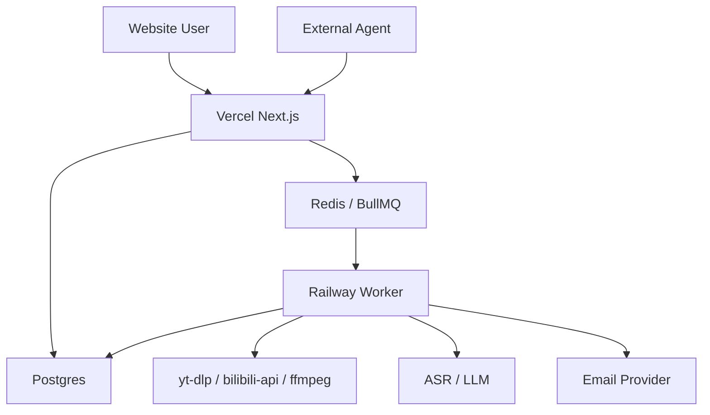

# Video Digest Deployment Guide

## 目标

本文档描述视频摘要系统的部署方案，重点回答三个问题：

- Next.js 部署在哪里。
- Worker 部署在哪里。
- Next.js 如何触发 worker 处理任务。

推荐 MVP 部署形态：

```txt
Vercel: Next.js web + /api/mcp
Railway: Node.js worker
Postgres: 用户、任务、摘要、投递记录
Redis: BullMQ 队列
```

## 核心结论

Next.js 不应该直接 HTTP 调用 worker。

推荐调用链：

```txt
Next.js /api/mcp
  -> 写 Postgres 创建任务记录
  -> 写 Redis/BullMQ 入队
  -> 返回 jobId

Railway Worker
  -> 监听 Redis/BullMQ
  -> 消费 job
  -> 提取字幕/音频
  -> ASR/总结/发送邮件
  -> 写回 Postgres

Next.js 页面或 MCP tool
  -> 查询 Postgres
  -> 返回任务状态和结果
```

也就是说，Next.js 是入口，worker 是后台执行器，Redis 是派单系统，Postgres 是事实记录。

## 部署拓扑



## Vercel 负责什么

Vercel 适合承载：

- Next.js 页面。
- 用户登录和鉴权。
- `/api/mcp` MCP endpoint。
- MCP token 校验。
- 创建任务。
- 查询任务状态。
- 展示记录和摘要。
- 管理邮箱、MCP token、用量。

Vercel 不建议承载：

- 长时间视频处理。
- `yt-dlp` 下载或提取音频。
- `ffmpeg` 转码。
- 大文件临时存储。
- 长时间 ASR。
- 常驻队列 consumer。

## Railway Worker 负责什么

Railway worker 是常驻后台进程。

职责：

- 连接 Redis 队列。
- 消费 video digest jobs。
- 调用 YouTube provider。
- 调用 Bilibili provider。
- 调用 `yt-dlp`。
- 调用 `ffmpeg`。
- 调用 ASR。
- 调用 LLM。
- 发送邮件。
- 更新 Postgres 中的任务状态。
- 处理失败、重试和日志。

Worker 主语言建议使用 TypeScript/Node.js。Python、`yt-dlp`、`ffmpeg` 作为 CLI 或 provider 实现细节被 Node 调用。

## 为什么不用 Next.js 直接调 worker

不推荐：

```txt
Next.js
  -> HTTP POST Railway Worker /process
  -> 等待处理完成
```

原因：

- 视频处理可能超过 HTTP 请求时长。
- worker 失败时不好恢复。
- 用户刷新页面会丢失请求上下文。
- 重试、并发、限流会变复杂。
- 很难展示细粒度进度。

推荐：

```txt
Next.js
  -> enqueue job
  -> return jobId

Worker
  -> consume job
  -> update status
```

这种方式天然支持：

- 后台处理。
- 失败重试。
- 进度展示。
- 多 worker 横向扩容。
- 外部 agent 查询任务状态。

## Redis/BullMQ 的角色

Redis 不存业务结果，只负责队列。

BullMQ 使用 Redis 存：

- 等待执行的 jobs。
- 正在执行的 jobs。
- 重试次数。
- 延迟任务。
- 失败任务状态。

业务状态仍然写入 Postgres：

```txt
video_records.status
video_records.errorCode
video_records.errorMessage
transcripts
summaries
delivery_records
```

这样即使 Redis 中的 job 被清理，用户历史记录仍然完整。

## 数据流

### 创建任务

```txt
User / Agent
  -> Next.js /api/mcp
  -> create_video_digest_job
  -> insert video_record status=queued
  -> queue.add("video-digest", { recordId })
  -> return { jobId, recordId }
```

### Worker 处理

```txt
Worker receives job
  -> update status=fetching_metadata
  -> update status=extracting_transcript
  -> if no transcript and fallback enabled:
       update status=extracting_audio
       update status=transcribing_audio
  -> update status=summarizing
  -> update status=delivering
  -> update status=completed
```

### 页面查询

```txt
Record detail page
  -> GET record status/result
  -> read Postgres
  -> render progress/summary/error
```

### Agent 查询

```txt
External Agent
  -> get_digest_job_status
  -> MCP tool reads Postgres
  -> return status/result
```

## 推荐环境变量

### Vercel

Vercel 只需要入口、鉴权、数据库和队列相关配置。

```txt
DATABASE_URL=
REDIS_URL=
MCP_TOKEN_SECRET=
NEXTAUTH_SECRET=
NEXTAUTH_URL=
```

如果 Vercel 不直接执行视频处理，不需要：

```txt
YTDLP_PATH
FFMPEG_PATH
BILI_COOKIE
```

### Railway Worker

Worker 需要完整处理能力。

```txt
DATABASE_URL=
REDIS_URL=
OPENAI_API_KEY=
RESEND_API_KEY=
YTDLP_PATH=yt-dlp
FFMPEG_PATH=ffmpeg
BILI_COOKIE=
```

如果 Bilibili provider 使用 Python 版 `bilibili-api`：

```txt
PYTHON_BIN=python3
```

## Worker Dockerfile

示例：

```dockerfile
FROM node:22-bookworm

RUN apt-get update \
  && apt-get install -y --no-install-recommends \
    python3 \
    python3-pip \
    ffmpeg \
  && rm -rf /var/lib/apt/lists/*

RUN pip3 install --break-system-packages yt-dlp bilibili-api-python

WORKDIR /app

COPY package.json pnpm-lock.yaml pnpm-workspace.yaml ./
COPY apps ./apps
COPY packages ./packages

RUN corepack enable
RUN pnpm install --frozen-lockfile
RUN pnpm --filter worker build

CMD ["pnpm", "--filter", "worker", "start"]
```

如果后续 Bilibili 不使用 Python provider，可以删除 `bilibili-api-python`。

## Railway 配置

建议配置：

```txt
Root Directory: /
Dockerfile Path: apps/worker/Dockerfile
Start Command: use Dockerfile CMD
```

Railway service 类型：

```txt
Worker / Background service
```

不要把它当成对外 HTTP API 服务，除非后续确实要拆出 extractor API。

## Queue Package 设计

推荐抽一个共享 package：

```txt
packages/queue/
  src/
    connection.ts
    videoDigestQueue.ts
    enqueueVideoDigestJob.ts
```

Next.js 使用：

```ts
await enqueueVideoDigestJob({
  recordId,
  userId,
  url,
  options,
});
```

Worker 使用：

```ts
createVideoDigestWorker(async (job) => {
  await processVideoDigestJob(job.data);
});
```

## BullMQ 最小代码形态

Queue：

```ts
import { Queue } from "bullmq";

export const videoDigestQueue = new Queue("video-digest", {
  connection: {
    url: process.env.REDIS_URL,
  },
});
```

Enqueue：

```ts
export async function enqueueVideoDigestJob(input: {
  recordId: string;
  userId: string;
  url: string;
}) {
  return videoDigestQueue.add("create-digest", input, {
    attempts: 3,
    backoff: {
      type: "exponential",
      delay: 10_000,
    },
    removeOnComplete: true,
    removeOnFail: false,
  });
}
```

Worker：

```ts
import { Worker } from "bullmq";

new Worker(
  "video-digest",
  async (job) => {
    await processVideoDigestJob(job.data);
  },
  {
    connection: {
      url: process.env.REDIS_URL,
    },
    concurrency: 2,
  },
);
```

## Redis 选择

MVP 推荐：

```txt
Railway Redis
Redis Cloud
Render Redis
```

如果 worker 放 Railway，Redis 也先放 Railway 会更省心。

注意：BullMQ 需要较完整的 Redis 命令支持。选择 Redis 服务时需要确认兼容性。

## Postgres 选择

可选：

```txt
Neon
Supabase
Railway Postgres
Render Postgres
```

建议一开始使用托管 Postgres，避免自己运维备份和连接池。

## 失败和重试策略

建议分两层：

BullMQ 负责任务级重试：

```txt
attempts=3
exponential backoff
```

业务层负责状态记录：

```txt
status=failed
errorCode=ASR_FAILED
errorMessage=...
```

不是所有错误都应该重试。

适合重试：

```txt
NETWORK_ERROR
LLM_TIMEOUT
EMAIL_SEND_FAILED
ASR_TEMPORARY_FAILED
```

不适合自动重试：

```txt
UNSUPPORTED_PLATFORM
NO_TRANSCRIPT_AND_AUDIO_DISABLED
FORBIDDEN
LOGIN_REQUIRED
```

## 临时文件策略

Worker 处理音频时应使用 job 级临时目录：

```txt
/tmp/video-digest/{recordId}/
```

处理完成后清理：

```txt
finally {
  cleanupTempDir(recordId)
}
```

不要长期保存音频文件，除非用户明确开启存档能力。

## 扩容方式

当任务变多时，可以增加 worker 实例。

```txt
Railway Worker x 1
Railway Worker x 2
Railway Worker x N
```

BullMQ 会让多个 worker 竞争消费同一个队列。

需要注意：

- 设置合理 concurrency。
- 控制 ASR/LLM 并发，避免费用失控。
- 控制同一用户的并发任务数。
- 对音频转写任务单独限流。

## MVP 部署建议

第一版推荐：

```txt
Vercel:
  apps/web

Railway:
  apps/worker
  Redis

Neon or Supabase:
  Postgres

Resend:
  Email

OpenAI or other provider:
  Summary and ASR
```

后续如果 worker 成本或并发上来，再考虑：

```txt
Fly.io
AWS ECS/Fargate
Google Cloud Run
自建 VPS + Docker Compose
```

## 与其他文档的关系

- `video-digest-mcp-architecture.md` 描述 MCP-first 的能力层架构。
- `video-digest-web-product.md` 描述网页产品体验和记录页面。
- 本文档描述部署、worker、队列和运行时边界。

## 最终结论

推荐部署方式：

```txt
Vercel 跑 Next.js 和 MCP endpoint
Railway 跑常驻 Node.js worker
Redis/BullMQ 负责派发任务
Postgres 负责保存任务和结果
```

Next.js 通过入队“调用” worker，而不是直接 HTTP 请求 worker。这个边界能避免超时问题，也方便后续做进度展示、失败重试和多 worker 扩容。
