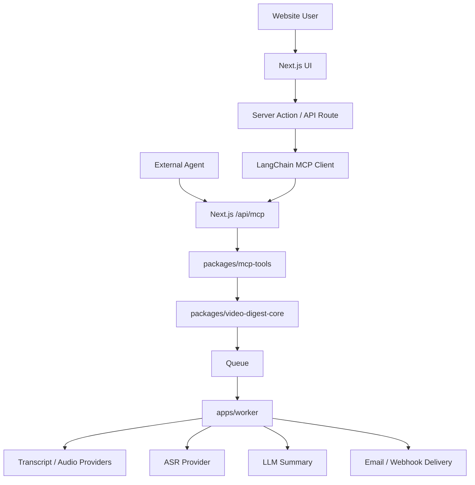

# Video Digest MCP-first Architecture

## 目标

本项目目标是构建一个基于 Next.js 的视频内容处理系统，支持从 Bilibili 和 YouTube 提取字幕或音频内容，并将内容交给 AI 或外部 agent 进行总结，最终通过邮件、webhook 或其他渠道投递。

系统采用 MCP-first 的能力网关设计：

- Next.js 暴露 MCP endpoint，作为统一能力入口。
- 外部 agent 可以直接调用 MCP tools。
- Next.js 内部需要使用这些能力时，通过服务端 LangChain MCP client 调用同一个 MCP endpoint。
- 真实业务实现放在 core packages 中，MCP tools 只负责协议、schema、权限和调用编排。

## 核心原则

1. MCP 是能力契约层，不是业务实现层。
2. Next.js 可以托管 MCP endpoint，不必一开始单独部署 MCP server。
3. 网站内部和外部 agent 尽量调用同一组 MCP tools，减少双轨 API。
4. 视频处理、ASR、总结、邮件投递等耗时任务通过 job/worker 异步执行。
5. 外部 agent 不需要配置底层第三方密钥，只需要配置 MCP URL 和 MCP token。
6. 邮件投递类 tools 必须严格鉴权、限流，并限制目标邮箱范围。

## 总体架构

```txt
Browser
  -> Next.js UI
  -> Server Action / API Route
  -> LangChain MCP Client
  -> /api/mcp
  -> MCP Tools
  -> Core Services
  -> Queue / Worker
  -> yt-dlp / bilibili-api / ASR / LLM / Email

External Agent
  -> /api/mcp
  -> MCP Tools
  -> Core Services
  -> Queue / Worker
```



## 推荐目录结构

```txt
apps/
  web/
    app/
      api/
        mcp/
          route.ts              # MCP HTTP endpoint
      actions/
        videoDigest.ts          # 网站内部动作，服务端调用 MCP

  worker/
    src/
      index.ts                  # 消费视频处理任务
      processors/
        videoDigest.ts

packages/
  mcp-tools/
    src/
      registerTools.ts
      tools/
        metadata.ts
        transcript.ts
        summary.ts
        delivery.ts
        jobs.ts

  mcp-client/
    src/
      createInternalMcpClient.ts
      runVideoDigestAgent.ts

  video-digest-core/
    src/
      transcript/
      summary/
      delivery/
      jobs/
      types.ts

  source-youtube/
    src/
      ytDlp.ts
      parseSubtitle.ts

  source-bilibili/
    src/
      bilibiliApi.ts
      parseSubtitle.ts

  asr/
    src/
      transcribeAudio.ts

  auth/
    src/
      mcpToken.ts
      actor.ts
      scopes.ts

  job-contracts/
    src/
      schemas.ts
      types.ts

  queue/
  database/
  delivery/
```

## 层级职责

### apps/web

Next.js 主应用，承担三类入口：

- 用户界面。
- 普通网站 API。
- MCP endpoint：`/api/mcp`。

网站内部如果需要使用视频处理能力，不直接调用 core service，而是在服务端通过 LangChain MCP client 调用 `/api/mcp`。这样网站内部和外部 agent 共用同一套 tool 契约。

### packages/mcp-tools

定义 MCP tools，不作为独立服务器。

职责：

- 定义 tool 名称。
- 定义 input schema。
- 定义 output schema。
- 定义 tool 描述。
- 定义 required scopes。
- 将 MCP input 转换为 core service input。
- 将 core service result 格式化为 MCP response。

不应该在这一层直接写复杂业务逻辑。

### packages/video-digest-core

真实业务实现层。

职责：

- 平台识别。
- 字幕提取流程编排。
- 无字幕时音频 fallback 策略。
- 创建 job。
- 查询 job 状态。
- 调用 summarizer。
- 调用 delivery。
- 执行业务权限检查。

### apps/worker

处理长任务。

职责：

- 提取字幕。
- 提取音频。
- 调用 ASR。
- 调用 LLM。
- 发送邮件。
- 更新 job 状态。
- 写入日志和失败原因。

视频处理不建议在 Next.js request 生命周期内同步完成。

## MCP Endpoint

Next.js 可以直接托管 MCP endpoint：

```txt
POST /api/mcp
GET /api/mcp
DELETE /api/mcp
```

外部 agent 配置：

```txt
MCP URL: https://your-domain.com/api/mcp
Authorization: Bearer mcp_xxx
```

内部 LangChain 调用：

```txt
Next.js Server Action
  -> 根据当前 session 生成 internal user-scoped MCP auth
  -> LangChain MCP client
  -> https://your-domain.com/api/mcp
```

内部 token 不应暴露给浏览器。

## Tool 分层设计

Tools 分为三类：内容提取、内容生成、内容投递。

### 内容提取 Tools

这些 tools 只负责输出可被 agent 使用的内容。

```txt
get_video_metadata
create_transcript_job
get_transcript_job_status
get_transcript_chunk
```

推荐让 transcript 走 job 和 chunk 读取，不建议一次性把长字幕全部返回给 agent。

### 内容生成 Tools

这些 tools 使用项目内部模型能力进行总结。

```txt
summarize_transcript
create_video_digest_job
get_video_digest_result
```

外部 agent 可以选择不使用这类 tools，而是自己拿 transcript 后自行总结。

### 内容投递 Tools

这些 tools 负责将已有内容投递出去。

```txt
get_my_verified_emails
send_digest_email
send_webhook
```

外部 agent 的典型流程：

```txt
1. create_transcript_job(url)
2. get_transcript_chunk(transcriptId, cursor)
3. agent 自己总结内容
4. get_my_verified_emails()
5. send_digest_email(contentMarkdown, toEmailId)
```

网站内部的一键流程：

```txt
create_video_digest_job(url, delivery)
```

## 推荐 Tool 契约

### create_transcript_job

用途：创建字幕提取任务。

```ts
type CreateTranscriptJobInput = {
  url: string;
  platform?: "youtube" | "bilibili" | "auto";
  preferredLanguages?: string[];
  fallbackToAudio?: boolean;
};
```

返回：

```ts
type CreateTranscriptJobOutput = {
  jobId: string;
  status: "queued";
};
```

### get_transcript_chunk

用途：分页读取字幕内容，避免一次性返回过长文本。

```ts
type GetTranscriptChunkInput = {
  transcriptId: string;
  cursor?: string;
  limit?: number;
};
```

返回：

```ts
type GetTranscriptChunkOutput = {
  transcriptId: string;
  chunk: string;
  nextCursor?: string;
  done: boolean;
};
```

### summarize_transcript

用途：使用项目内部 LLM 能力总结 transcript。

```ts
type SummarizeTranscriptInput = {
  transcriptId: string;
  language?: "zh-CN" | "en";
  format?: "brief" | "detailed" | "email_digest";
};
```

### send_digest_email

用途：发送已有摘要内容到用户已验证邮箱。

```ts
type SendDigestEmailInput = {
  toEmailId: string;
  subject: string;
  contentMarkdown: string;
  sourceUrl?: string;
};
```

不推荐外部 agent 直接传任意邮箱地址。应先通过 `get_my_verified_emails` 获取当前 actor 可用的邮箱 ID。

## 鉴权模型

入口鉴权在 Next.js MCP endpoint 处理。

```txt
Agent
  -> Authorization: Bearer mcp_xxx
  -> /api/mcp
  -> authenticateMcpRequest()
  -> actor
  -> tool handler
  -> core service
```

### Actor

```ts
type Actor = {
  type: "user" | "agent" | "system";
  id: string;
  userId?: string;
  tenantId?: string;
  scopes: string[];
  plan?: "free" | "pro" | "admin";
};
```

### Scope

建议先定义这些 scope：

```txt
video:metadata
video:transcript:create
video:transcript:read
video:summarize
digest:create
digest:read
email:read_verified
email:send
webhook:send
```

### MCP Token

MCP token 应独立于普通网页登录 session。

数据库中建议存：

```txt
id
userId
name
tokenHash
scopes
expiresAt
lastUsedAt
revokedAt
createdAt
```

外部 agent 使用长期 MCP token。网站内部调用 MCP 时，可以使用短期 internal token，或在服务端直接构造 actor context。

## 邮件安全策略

邮件 tools 是高风险能力，必须限制。

建议规则：

- 只能发送到当前用户已验证邮箱。
- 不允许外部 agent 自定义 From。
- subject 设置长度限制。
- contentMarkdown 设置大小限制。
- 每个 token 和用户都需要限流。
- 记录发送日志。
- 支持撤销 MCP token。
- `send_digest_email` 必须要求 `email:send` scope。

推荐流程：

```txt
get_my_verified_emails
  -> 返回 emailId 列表

send_digest_email
  -> 输入 toEmailId
  -> service 校验 emailId 是否属于 actor.userId
  -> 发送邮件
```

## 视频内容处理流程

### YouTube

推荐使用 `yt-dlp`。

流程：

```txt
1. 查询字幕列表
2. 有字幕则下载字幕
3. 解析 VTT/SRT
4. 没字幕且 fallbackToAudio=true，则提取音频
5. ffmpeg 转为 ASR 友好格式
6. 调用 ASR
7. 处理完成后删除临时音频
```

### Bilibili

推荐使用 `bilibili-api` 作为 B 站 provider 的主实现。

流程：

```txt
1. 获取视频信息
2. 查询字幕
3. 有字幕则下载并解析
4. 没字幕且 fallbackToAudio=true，则提取音频
5. 调用 ASR
6. 处理完成后删除临时音频
```

如果 B 站音频提取使用 `bilibili-api` 不稳定，可以在 provider 内部隐藏实现细节，使用 `yt-dlp` 作为音频 fallback。业务层仍只看到 Bilibili provider。

## Job 状态

建议统一 job 状态：

```txt
queued
fetching_metadata
extracting_transcript
extracting_audio
transcribing_audio
summarizing
delivering
completed
failed
cancelled
```

失败原因建议结构化：

```txt
UNSUPPORTED_PLATFORM
LOGIN_REQUIRED
NO_TRANSCRIPT
NO_TRANSCRIPT_AND_AUDIO_DISABLED
AUDIO_EXTRACT_FAILED
ASR_FAILED
SUMMARY_FAILED
EMAIL_SEND_FAILED
RATE_LIMITED
FORBIDDEN
```

## 内部 LangChain 调用 MCP

内部调用应该发生在服务端：

```txt
User Browser
  -> Server Action
  -> read session
  -> build internal actor/token
  -> LangChain MCP client
  -> /api/mcp
```

适合 LangChain 的场景：

- 用户输入自然语言，比如“总结这个视频并发到我的邮箱”。
- 需要模型选择调用哪些 tools。
- 需要把 transcript、summary、email tool 串起来。

不一定需要 LangChain 的场景：

- 表单已经明确提交 URL 和邮箱。
- 只需要固定流程。

固定流程可以直接调用高层 MCP tool：

```txt
create_video_digest_job
```

## 内部和外部调用模式

### 外部 Agent 自己总结

```txt
External Agent
  -> create_transcript_job
  -> get_transcript_job_status
  -> get_transcript_chunk
  -> agent summarize
  -> send_digest_email
```

### 网站内部一键摘要

```txt
Next.js Server Action
  -> LangChain MCP Client
  -> create_video_digest_job
  -> get_video_digest_result
```

### 网站内部 agent 编排

```txt
Next.js Server Action
  -> LangChain Agent
  -> create_transcript_job
  -> get_transcript_chunk
  -> summarize_transcript
  -> send_digest_email
```

## 环境变量

底层密钥只配置在服务端。

```txt
DATABASE_URL=
REDIS_URL=
OPENAI_API_KEY=
RESEND_API_KEY=
YTDLP_PATH=
FFMPEG_PATH=
BILI_COOKIE=
MCP_TOKEN_SECRET=
```

外部 agent 只需要：

```txt
MCP_SERVER_URL=https://your-domain.com/api/mcp
MCP_TOKEN=mcp_xxx
```

## 部署建议

MVP 阶段：

```txt
Vercel:
  apps/web 托管 Next.js 页面和 MCP endpoint

Railway:
  apps/worker 常驻消费队列并处理长任务

Postgres:
  存用户、token、任务、字幕、摘要和投递记录

Redis/BullMQ:
  负责从 Next.js 到 worker 的任务派发
```

Next.js 不直接 HTTP 调用 worker。推荐由 MCP tool 写入 Postgres 并把 job 放进 Redis/BullMQ，worker 从队列消费任务，处理完成后再写回 Postgres。页面和 agent 查询结果时读取 Postgres。

后续需要扩展时再拆：

```txt
apps/mcp-server
apps/video-digest-api
apps/extractor-worker
```

拆分条件：

- MCP 流量需要独立扩容。
- Next.js 平台不适合 MCP streaming/长连接。
- 视频处理 worker 需要独立资源池。
- Bilibili/YouTube provider 需要隔离运行环境。
- 需要把 MCP 能力作为独立产品售卖。

部署细节见 `video-digest-deployment.md`。

## 推荐实施阶段

### Phase 1: MCP-first MVP

- 在 Next.js 中实现 `/api/mcp`。
- 实现 `packages/mcp-tools`。
- 实现 `packages/video-digest-core` 的最小能力。
- YouTube provider 使用 `yt-dlp`。
- Bilibili provider 使用 `bilibili-api`。
- 邮件只允许发送到已验证邮箱。
- 外部 agent 使用 MCP token 调用。

### Phase 2: 异步任务和投递

- 引入 worker。
- 实现 transcript job。
- 实现 digest job。
- 实现 job status/result tools。
- 增加失败原因、重试和限流。

### Phase 3: 内部 LangChain 编排

- 实现 `packages/mcp-client`。
- Next.js server action 通过 LangChain MCP client 调用 `/api/mcp`。
- 支持自然语言指令触发摘要和邮件投递。

### Phase 4: Agent 生态开放

- 增加 MCP token 管理页面。
- 支持 scopes 配置。
- 增加调用日志和用量统计。
- 增加 webhook delivery。
- 增加 tool 文档和示例。

## 最终结论

推荐采用：

```txt
Next.js /api/mcp = 统一 MCP 能力网关
packages/mcp-tools = 统一 tool 契约
packages/video-digest-core = 真实业务实现
apps/worker = 长任务执行
LangChain MCP client = 网站内部 agent 编排
External Agent = 直接调用同一个 MCP endpoint
```

这个架构能让网站、外部 agent、未来机器人都围绕同一套 MCP tools 工作。后续主要维护 MCP tool 契约，同时保留 core service 的清晰边界，避免把业务逻辑锁死在协议层。
